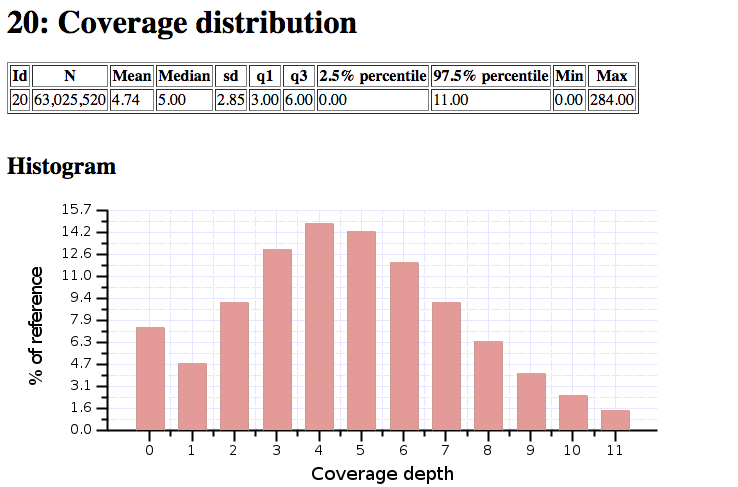
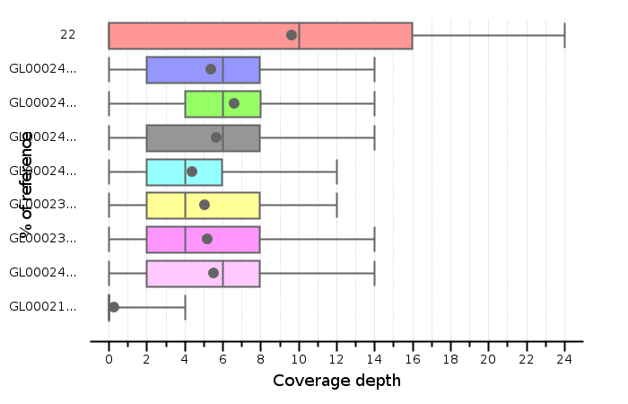
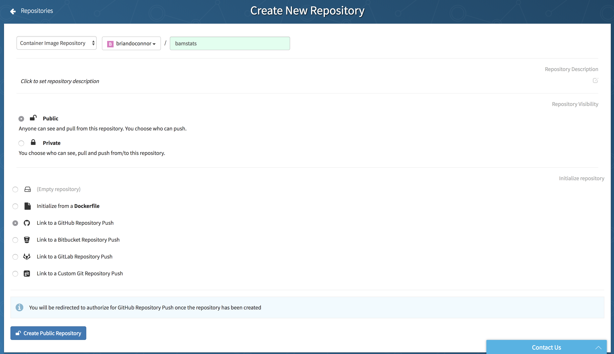
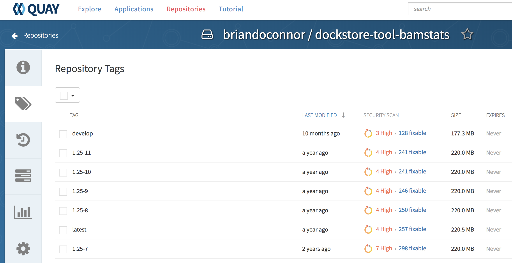
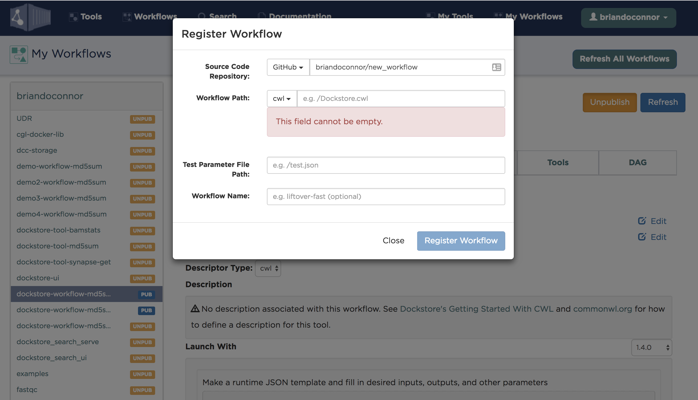

# Bioinformatics on Big Data Module 11 Lab

This lab was originally created by Solomon Shorser and adapted by Brian O'Connor for the 2018 class.

## Introduction

### Description of the lab

Welcome to the lab for Working Reproducibly in the Cloud! This lab will consolidate what you have learned about Cloud Computing by building a Docker-based tool, describing that tool in CWL, linking tools together in a workflow, and aligning reads from a cell line as an example using that workflow.

After this lab, you will be able to:

* Install the Dockstore CLI, CWLTool, Cromwell
* Docker-ize a tool
* Describe the tool with CWL
* Write a workflow in CWL
* Run CWL tools and workflows using the Dockstore CLI
* Know how to find additional Docker-based tools and workflows on Dockstore and other locations
* Know how Dockstore can help you share your tools/workflows
* Know about platforms that can run your workflows at scale

Things to know before you start:

* The lab may take between 1-1.5 hours, depending on your familiarity with Cloud Computing and alignment tasks.
* I highly recommend you use `screen` with your ssh connection to ensure your long-running workflow isn't terminated

### Launching a VM

Set up a fresh VM by following the instructions in the [Module 10 lab] (https://github.com/bioinformaticsdotca/BiCG_2018/blob/master/module10/lab.md), with the following characteristics:

* choose flavor c1.large
* assign a floating IP

> **Tip:** We'll only use a jump or gateway server if we don't have enough float IP addresses.

Without a floating IP, this VM is only accessible from Collaboratory.  Note that there are often not enough floating IPs for all VMs when you're running a fleet.  So you may want to set up a "jump server" as a gateway to ssh from outside into Collaboratory.  Then from the jump server, you can ssh into any of the VMs in your fleet.  You can use a VM (c1.micro) as a jump server.  If you haven't already done so, add your private key to the jump server.  From the console, find the IP address of the new c1.large VM and ssh into it.

```
ssh -i path_to_private_key ubuntu@10.0.0.XXX
```

### Getting Class Materials

If you're reading this you probably have found the repo that contains
all the examples.  You can checkout the following git repo on your VM:

```
git clone https://github.com/bioinformaticsdotca/BiCG_2018.git
cd BiCG_2018/module11/
```

If you're working on a VM I prepared this is likely to be done already for
you.  Make sure you're up to date though with a:

```
cd BiCG_2018/module11/
git pull
```

## Setting up your VM

The instructions below will walk you through how to take a base Ubuntu 16
VM and manually install all the dependencies you need for this tutorial.
While it's quite simple, it's also time consuming.  

Let's cheat!  I included an `install.sh` script to automate what's described below.  
Invoke it using:

```
cd BiCG_2018/module11
git pull
bash install.sh
```

After running this **log out of your VM and log back in**.  This will ensure
Docker is setup correctly.

We will quickly walk through the below so you know what each step is doing...

### Install Java

```
sudo add-apt-repository ppa:webupd8team/java
sudo apt-get update
sudo apt-get install oracle-java8-installer
```

### Get the dockstore tool

The Dockstore command line is nice in that it allows you to run CWL and WDL
tools and workflows using a common command line.  It also is capable of
provisioning files to and from cloud locations, something the underlying
cwltool/cromwell engines don't support.  For these reasons we'll use it
throughout this tutorial.

```
mkdir -p ~/bin
cd ~/bin
sudo apt-get install wget
wget https://github.com/ga4gh/dockstore/releases/download/1.3.6/dockstore
chmod u+x dockstore
```

### Add the location of the dockstore script to $PATH.

Using your favorite text editor (try pico if you don't have one), add this line to the end of ~/.bashrc:

```
PATH=$PATH:~/bin
```

Now, set up the dockstore configuration file:

```
cd ~
mkdir -p ~/.dockstore
touch ~/.dockstore/config
```

#### Add to ~/.dockstore/config these lines:

##### The URL for dockstore

```
server-url: https://dockstore.org:8443
```

##### A token

You only need a valid token if you want to push data TO dockstore. To pull data, "DUMMY" is fine.

```
token: DUMMY
```

##### Caching

Turn on caching to prevent the same input files from being downloaded again and again and again...

```
use-cache=true
```

### Install docker

```
sudo apt-get install curl
curl -sSL https://get.docker.com/ | sh
```

This will take a few minutes. Detailed installation information can be found [here] (https://docs.docker.com/v1.8/installation/ubuntulinux/)

#### Add your user to the docker user group

This is so you can run `docker` without having to sudo every time.   
After you execute the line below, you will need to **log out and log back in**.   

```
sudo usermod -aG docker $USER
```

### Get cwltool

This is the underlying engine that the Dockstore commannd line uses to
run CWL.  For WDL, we use Cromwell which will be installed on first use
via the Dockstore command line.

```
sudo apt install python-pip
pip install setuptools==36.5.0
pip install cwl-runner cwltool==1.0.20170828135420 schema-salad==2.6.20170806163416 avro==1.8.1 ruamel.yaml==0.14.12 requests==2.18.4
```

### Testing Your Install

At this point you can check to see if everything is installed
properly:

```
$ dockstore --version
Dockstore version 1.3.6
$ java -version
java version "1.8.0_144"
Java(TM) SE Runtime Environment (build 1.8.0_144-b01)
Java HotSpot(TM) 64-Bit Server VM (build 25.144-b01, mixed mode)
$ cwltool --version
/usr/local/bin/cwltool 1.0.20170828135420
$ docker run hello-world
Hello from Docker!
...
```

## Creating a New Docker-based Tool

Here we are making a Docker image that contains a simple tool bamstats.
This just produces a nice report on a BAM file.

### Make a Dockerfile

Make a `Dockerfile`, you can find this already created for you in
`bamstat_tool/Dockerfile`.

```
#############################################################
# Dockerfile to build a sample tool container for BAMStats
#############################################################

# Set the base image to Ubuntu
FROM ubuntu:14.04

# File Author / Maintainer
MAINTAINER Brian OConnor

# Setup packages
USER root
RUN apt-get -m update && apt-get install -y wget unzip openjdk-7-jre zip

# get the tool and install it in /usr/local/bin
RUN wget -q http://downloads.sourceforge.net/project/bamstats/BAMStats-1.25.zip
RUN unzip BAMStats-1.25.zip && \
    rm BAMStats-1.25.zip && \
    mv BAMStats-1.25 /opt/
COPY bin/bamstats /usr/local/bin/
RUN chmod a+x /usr/local/bin/bamstats

# switch back to the ubuntu user so this tool (and the files written) are not owned by root
RUN groupadd -r -g 1000 ubuntu && useradd -r -g ubuntu -u 1000 -m ubuntu
USER ubuntu

# by default /bin/bash is executed
CMD ["/bin/bash"]
```

### Build the Image

Now that we have the recipe created go ahead and build the Docker image:

```
# build it
docker build -t quay.io/briandoconnor/dockstore-tool-bamstats:1.25-11 .
# verify it was built
docker images
# you should see:
quay.io/briandoconnor/dockstore-tool-bamstats   1.25-11             28480694ac0e        7 seconds ago       450MB
```

### Describing with CWL

So at this point we have a tool nicely packaged up in a Docker image along with
all of its dependencies.  However, there's no standardized way to hand this
Docker image to another person and have them figure out how it was constructed,
where the binary is installed, how to call it, etc.  That's where the Common
Workflow Language comes in.  It allows you to *describe* the tool inside the
Docker image, making it much easier to share it with others.

Here is the `bamstat_tool/Dockstore.cwl` file for `bamstat`:

```
#!/usr/bin/env cwl-runner

class: CommandLineTool
id: BAMStats
label: BAMStats tool
cwlVersion: v1.0

$namespaces:
  dct: http://purl.org/dc/terms/
  foaf: http://xmlns.com/foaf/0.1/

doc: |
  
  A Docker container for the BAMStats command. See the [BAMStats](http://bamstats.sourceforge.net/) website for more information.


dct:creator:
  '@id': http://orcid.org/0000-0002-7681-6415
  foaf:name: Brian O'Connor
  foaf:mbox: briandoconnor@gmail.com

requirements:
- class: DockerRequirement
  dockerPull: quay.io/briandoconnor/dockstore-tool-bamstats:1.25-11
- class: InlineJavascriptRequirement

hints:
- class: ResourceRequirement
  coresMin: 1
  ramMin: 4092
  outdirMin: 512000
  description: the process requires at least 4G of RAM

inputs:
  bam_input:
    type: File
    format: http://edamontology.org/format_2572
    inputBinding:
      position: 2
    doc: The BAM file used as input, it must be sorted.

  mem_gb:
    type: int
    default: 4
    inputBinding:
      position: 1
    doc: The memory, in GB, for the reporting tool

outputs:
  bamstats_report:
    type: File
    format: http://edamontology.org/format_3615
    outputBinding:
      glob: bamstats_report.zip
    doc: A zip file that contains the HTML report and various graphics.

baseCommand: [bash, /usr/local/bin/bamstats]
```

So the Docker image + the CWL file clearly describe what this is and how
to use it!

You can use either the Dockstore or cwltool command to run this tool.  Let's
try.  First, create a configuration (see `bamstat_tool/sample_configs.json`):

```
{
  "bam_input": {
        "class": "File",
        "format": "http://edamontology.org/format_2572",
        "path": "https://s3.amazonaws.com/oconnor-test-bucket/sample-data/NA12878.chrom20.ILLUMINA.bwa.CEU.low_coverage.20121211.bam"
    },
    "bamstats_report": {
        "class": "File",
        "format": "http://edamontology.org/format_3615",
        "path": "/tmp/bamstats_report.zip"
    }
}
```

Notice we are pulling in a small bam file from the AWS cloud and the output
is written to the `/tmp` directory of the local machine.  The Dockstore
command is nice in that it lets you read and write data to/from Amazon S3.

Now launch with the dockstore command line:

```
dockstore tool launch --local-entry Dockstore.cwl --json sample_configs.json
```

This might take some time to run depending on how quick the transfer from the
cloud is.

> **Tip**: Notice we're using the `dockstore` command here.  We could have used the `cwltool` command here directly.  I like using the dockstore command as a wrapper since it 1) handles file provisioning to/from the cloud and 2) takes care of a lot of boilerplate.  For your reference see below for the example cwltool comamnd:

```
cwltool --enable-dev --non-strict --outdir /home/ubuntu/NimbusForOReilly/chapter_10_UCSC/cbw_class_tutorial/bamstat_tool/datastore//launcher-b99faa42-d2a4-42ce-85b5-c960d1d94082/outputs/ --tmpdir-prefix /home/ubuntu/NimbusForOReilly/chapter_10_UCSC/cbw_class_tutorial/bamstat_tool/datastore//launcher-b99faa42-d2a4-42ce-85b5-c960d1d94082/tmp/ --tmp-outdir-prefix /home/ubuntu/NimbusForOReilly/chapter_10_UCSC/cbw_class_tutorial/bamstat_tool/datastore//launcher-b99faa42-d2a4-42ce-85b5-c960d1d94082/working/ /home/ubuntu/NimbusForOReilly/chapter_10_UCSC/cbw_class_tutorial/bamstat_tool/Dockstore.cwl /home/ubuntu/NimbusForOReilly/chapter_10_UCSC/cbw_class_tutorial/bamstat_tool/datastore//launcher-b99faa42-d2a4-42ce-85b5-c960d1d94082/workflow_params.json
```

When this is done, transfer the zip file to your local machine and take a look
at the contents:

```
scp -i path_to_private_key ubuntu@10.0.0.XXX:/tmp/bamstats_report.zip
```

You may have to transfer from your VM, to the jump host, then to your local
computer for viewing.  Here's what the report looks like:



## Creating a CWL Workflow

Now that we have successfully create a Docker image that has a tool in it, described
that image with a CWL, and parameterized and ran it with the Dockstore command
line, it's time to take the next step: workflows!

Workflows let you string together multiple tools, some of which you may write
and others which you get from third parties.  Here we're going to write a
workflow that brings together the bwa-mem and bamstats tools into a common
workflow.

### Workflow Purpose

This workflow will first align fastq files for some sample test data then
it will run bamstats on the output bam file.  It will save both the bam
file and also the report zip file.

### Writing the CWL Workflow

Let's take a look at the workflow that calls alignment then bamstats.  
Notice we define inputs and outputs in a simpler fashion than the individual
tools.  And then connect steps by referencing the output of one step as
the input of the next step.

```
#!/usr/bin/env cwl-runner

class: Workflow
cwlVersion: v1.0

doc: "A simple pipeline that runs the bwa-mem tool from PCAWG then bamstats"

requirements:
  - class: MultipleInputFeatureRequirement
  - class: StepInputExpressionRequirement
  - class: InlineJavascriptRequirement

inputs:
  output_file_basename: string
  download_reference_files: string
  reference_gz_fai: File
  reference_gz: File
  reference_gz_pac: File
  reference_gz_amb: File
  reads: File[]
  reference_gz_bwt: File
  output_dir: string
  reference_gz_sa: File
  reference_gz_ann: File
  mem_gb: int

outputs:
  merged_output_bai:
    type: File
    outputSource: alignment/merged_output_bai
  merged_output_unmapped_metrics:
    type: File
    outputSource: alignment/merged_output_unmapped_metrics
  merged_output_bam:
    type: File
    outputSource: alignment/merged_output_bam
  merged_output_metrics:
    type: File
    outputSource: alignment/merged_output_metrics
  merged_output_unmapped_bai:
    type: File
    outputSource: alignment/merged_output_unmapped_bai
  merged_output_unmapped_bam:
    type: File
    outputSource: alignment/merged_output_unmapped_bam
  bamstats_report:
    type: File
    outputSource: report/bamstats_report

steps:
  alignment:
    run: ../bwamem_tool/Dockstore.cwl
    in:
      output_file_basename: output_file_basename
      download_reference_files: download_reference_files
      reference_gz_fai: reference_gz_fai
      reference_gz: reference_gz
      reference_gz_pac: reference_gz_pac
      reference_gz_amb: reference_gz_amb
      reads: reads
      reference_gz_bwt: reference_gz_bwt
      output_dir: output_dir
      reference_gz_sa: reference_gz_sa
      reference_gz_ann: reference_gz_ann

    out:
      [merged_output_bai, merged_output_unmapped_metrics, merged_output_bam, merged_output_metrics, merged_output_unmapped_bai, merged_output_unmapped_bam]

  report:
    run: ../bamstat_tool/Dockstore.cwl
    in:
      bam_input: alignment/merged_output_bam
      mem_gb: mem_gb
    out:
      [bamstats_report]
```

### Prepare your JSON input file

I've collected the inputs and reference files for you already, see the configuration
file below:

```
{
  "reads": [
  {
  "path":"../data/bwamem_workflow/hg19.chr22.5x.normal.bam",
  "class":"File"
  },
  {"path":"../data/bwamem_workflow/hg19.chr22.5x.normal2.bam",
  "class":"File"
  }
  ],
  "output_dir": "datastore",
  "output_file_basename": "hg19.chr22.5x.normal",
  "download_reference_files": "true",
  "reference_gz_amb": {
    "path": "../data/bwamem_workflow/genome.fa.gz.64.amb",
    "class": "File"
  },
  "reference_gz_sa": {
    "path": "../data/bwamem_workflow/genome.fa.gz.64.sa",
    "class": "File"
  },
  "reference_gz_pac": {
    "path": "../data/bwamem_workflow/genome.fa.gz.64.pac",
    "class": "File"
  },
  "reference_gz_ann": {
    "path": "../data/bwamem_workflow/genome.fa.gz.64.ann",
    "class": "File"
  },
  "reference_gz_bwt": {
    "path": "../data/bwamem_workflow/genome.fa.gz.64.bwt",
    "class": "File"
  },
  "reference_gz_fai": {
    "path": "../data/bwamem_workflow/genome.fa.gz.fai",
    "class": "File"
  },
  "reference_gz": {
    "path": "../data/bwamem_workflow/genome.fa.gz",
    "class": "File"
  },
  "merged_output_unmapped_bai": {
    "path": "/tmp/merged_output.unmapped.bam.bai",
    "class": "File"
  },
  "merged_output_bam": {
    "path": "/tmp/merged_output.bam",
    "class": "File"
  },
  "merged_output_unmapped_bam": {
    "path": "/tmp/merged_output.unmapped.bam",
    "class": "File"
  },
  "merged_output_bai": {
    "path": "/tmp/merged_output.bam.bai",
    "class": "File"
  },
  "bamstats_report": {
      "class": "File",
      "format": "http://edamontology.org/format_3615",
      "path": "/tmp/bamstats_report.zip"
  },
  "mem_gb": 20
}
```

### Running the Workflow with Dockstore CLI

At this point we should be ready to go!  Use the dockstore command line
to execute this workflow, keeping in mind it will take 20+ minutes to
align the sample data and generate the report.

I highly suggest you use a `screen` session, so if you need to close your
connection your workflow will still continue.

```
time dockstore workflow launch --local-entry alignment.cwl --json Dockstore_cwl_local.json
```

When the workflow finishes you should find the bamstat report in `/tmp/bamstats_report.zip`.
Like our previous run of this reporting tool, you can transfer the zip to your
local machine and unzip it to view the report.

```
...
Provisioning from /home/ubuntu/NimbusForOReilly/chapter_10_UCSC/cbw_class_tutorial/alignment_workflow/datastore/launcher-b4777485-a54c-4c4a-8ace-603e9db763b4/outputs/bamstats_report.zip to /tmp/bamstats_report.zip
[##################################################] 100%
Provisioning from /home/ubuntu/NimbusForOReilly/chapter_10_UCSC/cbw_class_tutorial/alignment_workflow/datastore/launcher-b4777485-a54c-4c4a-8ace-603e9db763b4/outputs/hg19.chr22.5x.normal.bam to /tmp/merged_output.bam
[##################################################] 100%
...

real    24m39.704s
user    0m10.544s
sys     0m2.336s
```

Here's an example of one of the plots from this report:



## Sharing Your Work

At this point we've covered a lot of ground:

* you made a Docker based tool (bamstat)
* you described that tool with CWL then ran it with the Dockstore command line
* you combined that bamstat tool with an existing bwa-mem tool from Dockstore/Quay.io into a workflow
* you ran that workflow using the Dockstore command line
* you collected and viewed the output for both

This is all well and good but the reason you went through the effort
is really for two benefits 1) docker-based tools and CWL tools and
workflow definitions are extremely portable, allowing you to execute in
a variety of places and 2) due to their portability it becomes
extremely easy to share with others.

A key part of scientific research is reproducibility.  So as you
develop workflows, perform analysis, and write your papers, sharing your tools and workflows with the community is absolutely critical. Docker and CWL allow you to share tools and workflows much more successfully than systems used in the past.  Here we cover at a high level the steps you can use to share your portable tools and workflows with others.

### Sharing Docker-based Tool on Quay.io

> **Tip**: If you want to share your Docker-based tools with others sign up for [Quay.io](https://quay.io/) and [GitHub](https://github.com) accounts.

You'll notice in the bamstats Docker-based tool tutorial we created
a Docker file and built the Docker image locally.  However, when we
created the workflow calling bwa-mem we never actually created the Docker image that had bwa-mem in it:

    quay.io/pancancer/pcawg-bwa-mem-workflow:2.6.8_1.2

Where did this come from?  It turns out, this was a public Docker
image hosted on quay.io.  See https://quay.io/repository/pancancer/pcawg-bwa-mem-workflow?tab=tags

If you want to share your docker-based tools it's easy.  You need to
do the following:

* create a new GitHub public repository and store your `Dockerfile` there
* make one or more releases in GitHub
* on Quay.io, create a new repository and link this to your GitHub repository
* Quay.io will automatically build and host your Docker-based tool!



Once setup, here's an example of what the bamstat tool looks like in quay.io



And this corresponds to the docker URL:

    quay.io/briandoconnor/dockstore-tool-bamstats:1.25-11

### Sharing the Workflow on Dockstore

> **Tip**: If you want to share your workflows with others sign up for [Dockstore.org](https://dockstore.org/) and [GitHub](https://github.com) accounts.

Similar to Docker bamstat tool, our workflow for alignment and
reporting was all just stored locally on your computer or VM.
But chances are good that you actually want to share your workflow
with others.  In which case Dockstore can help.

If you want to share your workflow you need to
do the following:

* create a new GitHub public repository and store your workflow (and associated tool) CWL files there
* make one or more releases in GitHub
* on Dockstore, log in, select 'my workflows', and click the '+' button on the organization you created this new GitHub repo in.
* fill in the information about the new GitHub repo and also the path to the workflow CWL (or WDL) file.
* you have the option of specifying a test parameterization file for your workflow, something that we highly recommend!



> **Tip**: Dockstore can also help you share tools in addition to workflows.  It's a slightly more complex process since you need to link a Docker tool on quay.io to a CWL/WDL descriptor on GitHub and then can register on Dockstore.  Still, this is nice if you're a tool author and want to share your tool with a wide audience.

### Additional Documentation

The instructions above are really just an overview intended to
give you an idea of how tool and workflow sharing work using
GitHub, Quay.io, and Dockstore.  The Dockstore provides much
more comprehensive documentation on our site, see https://dockstore.org/docs

## Finding Work by Others

Creating docker-based tools from scratch is a time-consuming process.  Ideally
many of the tools you need (and possibly even workflows as well) can already
be found on repository sites, allowing you to adapt them for your own needs
without having to start from scratch.  Several good sources of Docker-based
tools exist including:

* [DockerHub](https://hub.docker.com/): generic source of Docker-based tools
* [Quay.io](https://quay.io): generic source of Docker-based tools
* [biocontainers.pro](https://biocontainers.pro/): Docker-based tools (2K+) for the bio community
* [bio.tools](https://bio.tools/): a registry of bio software, some links to containers
* [Dockstore](https://dockstore.org): contains only a couple hundred Docker-based tools since the focus is more on well annotated workflows with test data.

You many find that many of these Docker-based tools can be used directly and
others you may find it best to "fork" their code to your own GitHub repository,
customize, and then build your own tools or workflows derived from the original.

## Other Technologies

Its been mentioned in passing but there are actually several workflow
languages out there that are popular in the community.  These include:

* [CWL](http://www.commonwl.org/)
* [Galaxy](https://galaxyproject.org/)
* [Nextflow](https://www.nextflow.io/)
* [WDL](https://software.broadinstitute.org/wdl/)

In addition there are a few Docker alternatives including:

* [Rkt](https://coreos.com/rkt/docs/latest/rkt-vs-other-projects.html): alternative from CoreOS
* [Singularity](http://geekyap.blogspot.com/2016/11/docker-vs-singularity-vs-shifter-in-hpc.html): focused on HPC

### Example WDL Workflow

WDL is an alternative workflow language that is gaining in popularity.
Like CWL, it is a document-oriented workflow language that can
run in an increasing number of platforms.  

It distinguishes itself from CWL in having a simplified syntax
but still affords many of the important features of CWL such as
scatter-gather.

Here's an example WDL workflow, compare this with the CWL
BEA alignment workflow above.

```
task Seqware_BWA_Workflow {
    Array[File] reads
    File reference_gz
    File reference_gz_fai
    File reference_gz_amb
    File reference_gz_ann
    File reference_gz_bwt
    File reference_gz_pac
    File reference_gz_sa
    String output_dir
    String output_file_basename
    String download_reference_files

    command {
        python /home/seqware/Seqware-BWA-Workflow/run_seqware_workflow.py \
        --files ${sep=' ' reads} \
        --output-dir ${output_dir} \
        --output-file-basename ${output_file_basename} \
        --download-reference-files ${download_reference_files} \
        --reference-gz ${reference_gz} \
        --reference-gz-fai ${reference_gz_fai} \
        --reference-gz-amb ${reference_gz_amb} \
        --reference-gz-ann ${reference_gz_ann} \
        --reference-gz-bwt ${reference_gz_bwt} \
        --reference-gz-pac ${reference_gz_pac} \
        --reference-gz-sa ${reference_gz_sa}
    }

    output {
        File merged_output_bam = '${output_dir}/${output_file_basename}.bam'
        File merged_output_bai = '${output_dir}/${output_file_basename}.bam.bai'
        File merged_output_metrics = '${output_dir}/${output_file_basename}.bam.metrics'
        File merged_output_unmapped_bam = '${output_dir}/${output_file_basename}.unmapped.bam'
        File merged_output_unmapped_bai = '${output_dir}/${output_file_basename}.unmapped.bam.bai'
        File merged_output_unmapped_metrics = '${output_dir}/${output_file_basename}.unmapped.bam.metrics'
    }

    runtime {
        docker: 'quay.io/pancancer/pcawg-bwa-mem-workflow:2.6.8'
    }
}

workflow Seqware_BWA_Workflow {
    call Seqware_BWA_Workflow
}
```

And the corresponding JSON parameterization file:

```
{
  "Seqware_BWA_Workflow.Seqware_BWA_Workflow.reads": ["https://dcc.icgc.org/api/v1/download?fn=/PCAWG/reference_data/data_for_testing/hg19.chr22.5x.normal.bam", "https://dcc.icgc.org/api/v1/download?fn=/PCAWG/reference_data/data_for_testing/hg19.chr22.5x.normal2.bam"],
  "Seqware_BWA_Workflow.Seqware_BWA_Workflow.download_reference_files": "True",
  "Seqware_BWA_Workflow.Seqware_BWA_Workflow.reference_gz": "https://dcc.icgc.org/api/v1/download?fn=/PCAWG/reference_data/pcawg-bwa-mem/genome.fa.gz",
  "Seqware_BWA_Workflow.Seqware_BWA_Workflow.reference_gz_fai": "https://dcc.icgc.org/api/v1/download?fn=/PCAWG/reference_data/pcawg-bwa-mem/genome.fa.gz.fai",
  "Seqware_BWA_Workflow.Seqware_BWA_Workflow.reference_gz_bwt": "https://dcc.icgc.org/api/v1/download?fn=/PCAWG/reference_data/pcawg-bwa-mem/genome.fa.gz.64.bwt",
  "Seqware_BWA_Workflow.Seqware_BWA_Workflow.reference_gz_amb": "https://dcc.icgc.org/api/v1/download?fn=/PCAWG/reference_data/pcawg-bwa-mem/genome.fa.gz.64.amb",
  "Seqware_BWA_Workflow.Seqware_BWA_Workflow.reference_gz_ann": "https://dcc.icgc.org/api/v1/download?fn=/PCAWG/reference_data/pcawg-bwa-mem/genome.fa.gz.64.ann",
  "Seqware_BWA_Workflow.Seqware_BWA_Workflow.reference_gz_sa": "https://dcc.icgc.org/api/v1/download?fn=/PCAWG/reference_data/pcawg-bwa-mem/genome.fa.gz.64.sa",
  "Seqware_BWA_Workflow.Seqware_BWA_Workflow.reference_gz_pac": "https://dcc.icgc.org/api/v1/download?fn=/PCAWG/reference_data/pcawg-bwa-mem/genome.fa.gz.64.pac",
  "Seqware_BWA_Workflow.Seqware_BWA_Workflow.output_dir": "/datastore/",
  "Seqware_BWA_Workflow.Seqware_BWA_Workflow.output_file_basename": "hg19.chr22.5x.normal"
}
```

Like CWL, the Dockstore command line can run WDL workflows.
For a more complex WDL example, see https://dockstore.org/workflows/gatk-workflows%2Fbroad-prod-wgs-germline-snps-indels

## Executing at Scale

In this tutorial we build and ran "locally" on our VM using the Dockstore
command line.  This is fine for testing and development but often times
you want to run a given tool or workflow on hundreds, thousands, or even tens of thousands of
samples.  There are several open source and commercial platforms that enable
this I recommend you look at:

### Commercial Platforms

* [Curoverse](https://curoverse.com/): CWL
* [DNAnexus](https://www.dnanexus.com/): WDL
* [DNAstack](https://www.dnastack.com/#/): WDL
* [Seven Bridges](https://www.sevenbridges.com/): CWL

### Open Source Platforms

* [Cromwell](https://github.com/broadinstitute/cromwell): supports WDL (see below) and CWL (dev support) on Google (other clouds soon)
* [Galaxy](https://github.com/galaxyproject/planemo): Planemo supports CWL
* [Toil](http://toil.ucsc-cgl.org/): supports CWL and WDL on multiple clouds
* [Nextflow](https://www.nextflow.io/): its own language and framework
